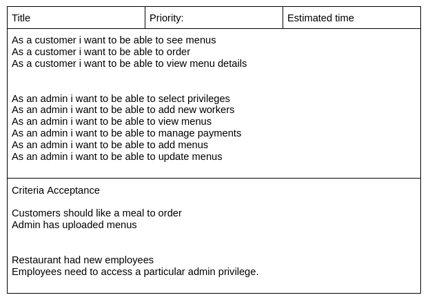
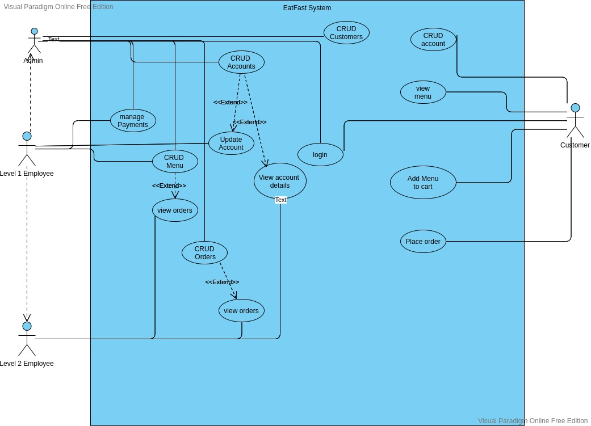
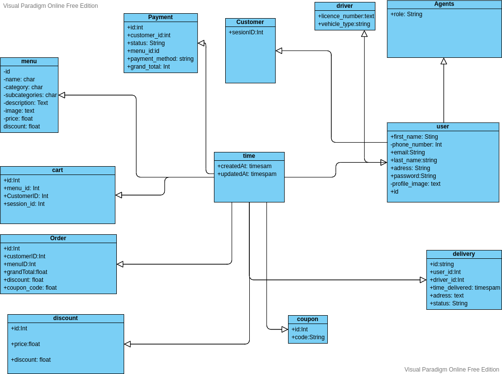
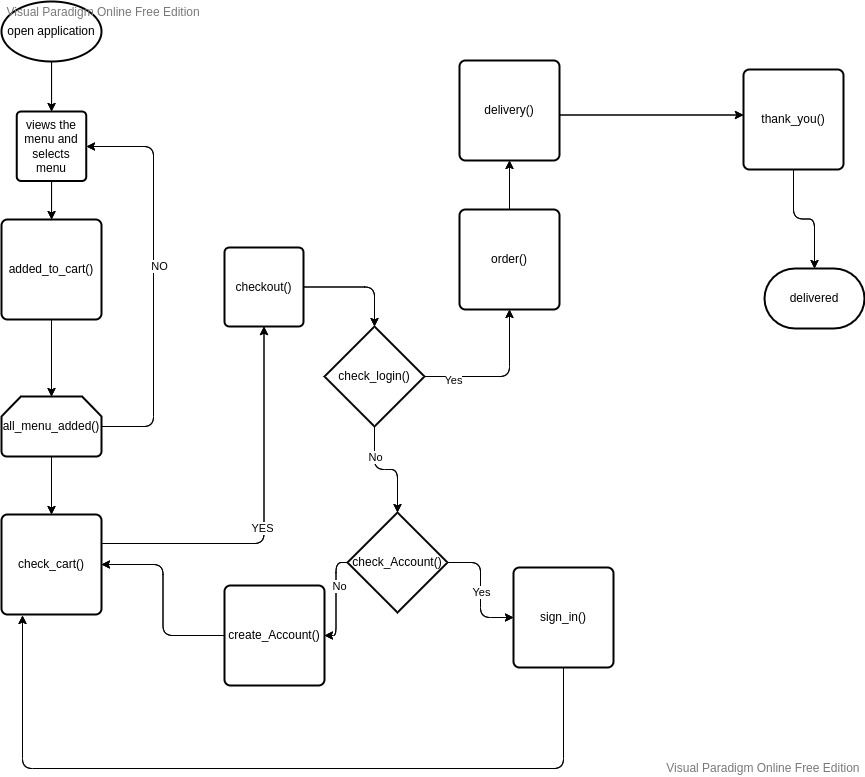

# EatFast

## Overview
EatFast Restaurant is a web application that helps in the management of a restaurant. The clients will be able to order a menu from the app and the restaurant manager will be able to see and  order for the menu to be served. The restaurant manager will also be able to CRUD menus to the application, manage payments, manage workers and access toles to the system.  

## User Story
 

 ## UML
 ### Use case Diagram
  

  ### Class Diagram
  

  ### FLow Charts

  #### User Flow charts

